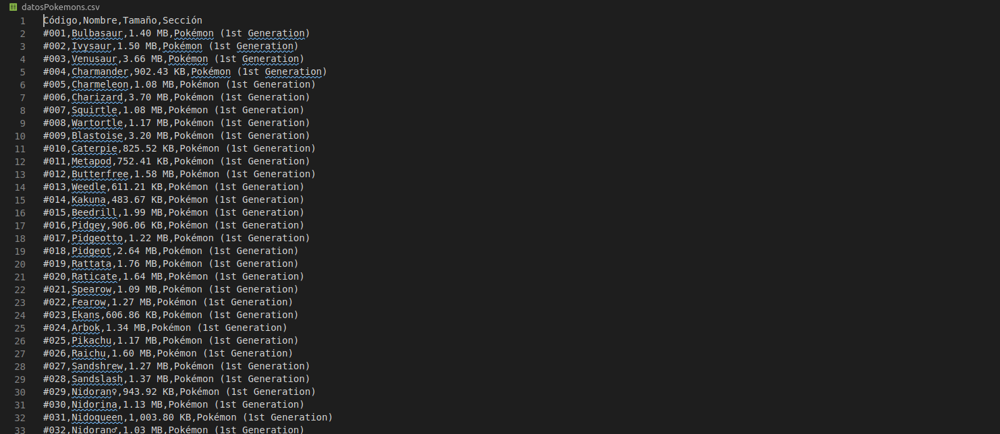

# scraperPokemons
Con la necesidad de obtener los ficheros zip que una página web nos brinda con los modelos 3d
de los pokemons del los juegos pokemon X y pokemon Y, he creado un pequeño script python para obtener estos ficheros. 

La página utilizada para descargar los ficheros es <https://www.models-resource.com/3ds/pokemonxy/>. Dicha página tiene los pokemons en
distintas secciones según su generación y ademas tiene mas modelos del juego como pueden ser personajes. En nuestro caso solo nos interesan los pokemons.

Recorreremos todas las secciones que contengan pokemon descargando la imagen de este y accediendo al link de la página de dicho pokemon. 

Como se ve en la siguiente imagen la página tienen un enlace para descargar el zip del pokemon y alguna información de este. Nos quedaremos algunos campos de informacion como el nombre y codigo, la sección a la que petenece, el tamaño del zip
y descargaremos el archivo zip con el enlace que viene al final de la tabla.

Al ejecutar todo el script nos genera las carpetas imágenes y archivosZips ademas de un archivo csv con el nombre datosPokemons.csv.

En la carpeta imágenes tendremos las imágenes de portada de los pokemons con su código como nombre.

En archivosZips de igual manera tendremos los archivos zips de cada pokemon. Estos archivos contienen los modelos 3d y serán nombrados también código del pokemon al que corresponde.

Por ultimo el archivo csv contendrá el código y nombre del pokemon, el tamaño del fichero zip y la sección a la que pertenece.

Al ejecutar el script nos dirá la sección por la que vamos de todas la que tenemos y cuantos pokemons de dicha sección nos falta para terminar.

Esto se ha realizado con la librería [Beautiful Soup](https://www.crummy.com/software/BeautifulSoup/bs4/doc/) de python que nos facilita mucho scrapear los datos de una web.
